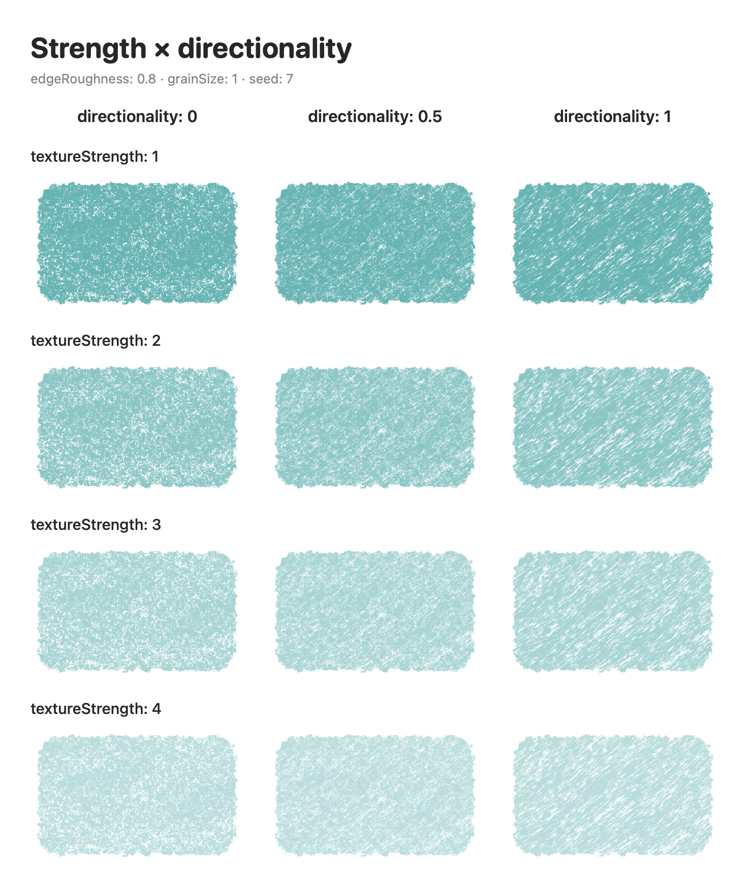
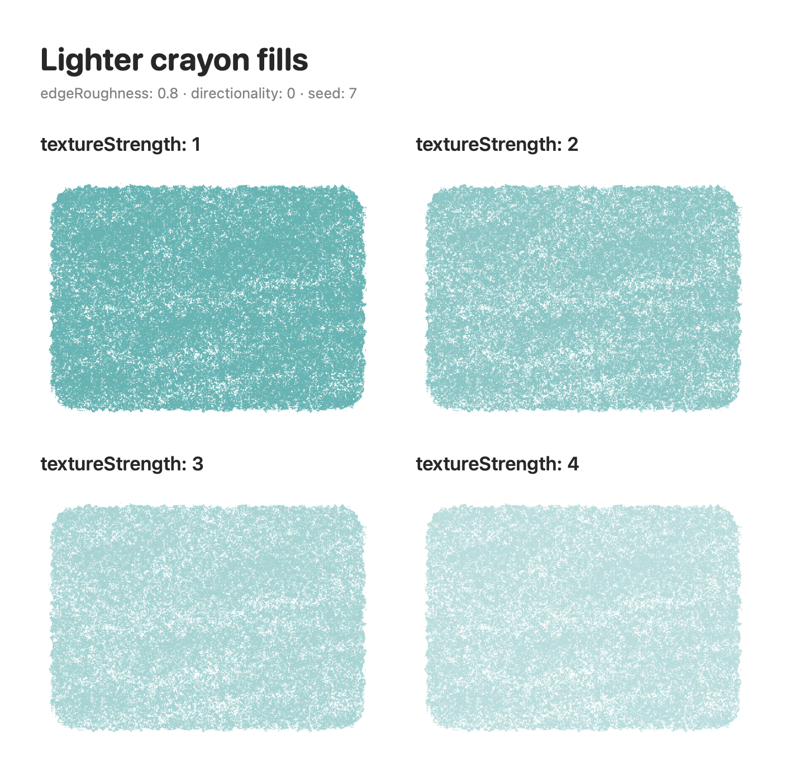
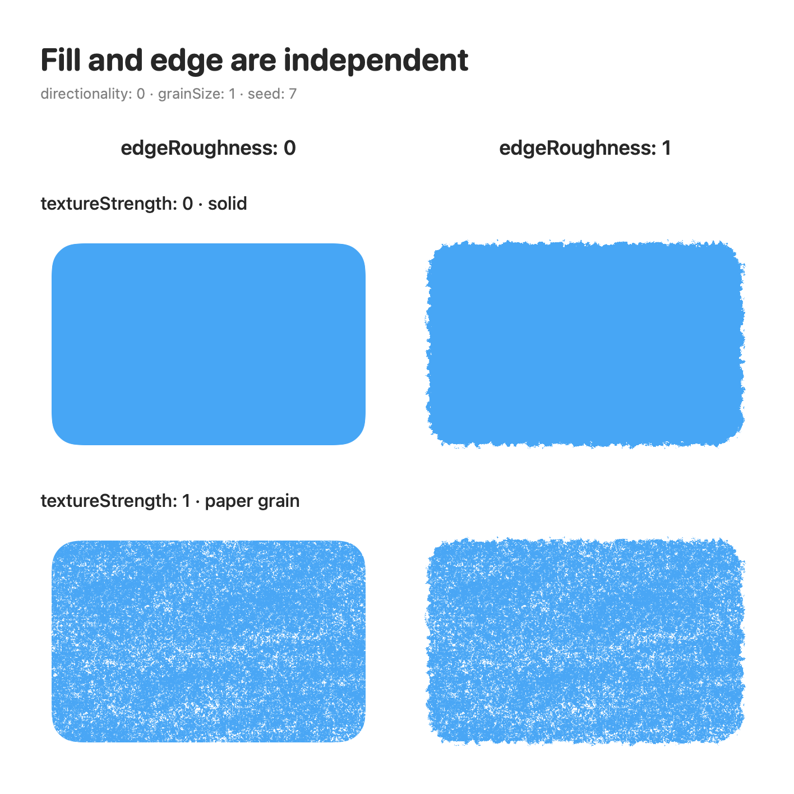

# Crayon

[EN](README.md) · [KR](README.ko.md) · [JP](README.ja.md) · [CN](README.zh-CN.md)

SwiftUI でクレヨンの塗り、ブラシ線、ざらついた輪郭、ボイリングアニメーションを描く Swift Package です。
外部画像なしでクレヨンの質感を生成でき、独自のブラシ先端とグレインも使用できます。


- **対応環境:** iOS 17+ · macOS 14+ · Swift tools 5.9+
- **製品 / import:** `Crayon`
- SwiftUI ベースで、外部パッケージへの依存はありません。

## クイックスタート

Xcode の **Add Package Dependencies** に
`https://github.com/eraser3031/crayon.git` を入力し、バージョン **0.2.0** を選んで、
アプリのターゲットに `Crayon` 製品を追加してください。

```swift
import SwiftUI
import Crayon

struct Drawing: View {
    var body: some View {
        RoundedRectangle(cornerRadius: 24)
            .brushFill(
                color: Color(red: 1, green: 0.84, blue: 0.25),
                textureStrength: 1,
                fillStyle: .crayon(seed: 7, edgeRoughness: 0.8, directionality: 0.5)
            )
            .frame(width: 280, height: 180)
            .padding(16)
    }
}
```

別の Swift Package からも依存関係として追加できます。

```swift
// Package.swift の dependencies
.package(url: "https://github.com/eraser3031/crayon.git", from: "0.2.0")

// 利用するターゲットの dependencies
.product(name: "Crayon", package: "crayon")
```

ローカル開発では Xcode の **Add Local** または `.package(path: "../crayon")` を使用してください。

## 描けるもの

| API | 用途 |
| --- | --- |
| `Shape.brushFill(..., fillStyle: .grain)` | 用意したブラシのグレインで塗りつぶす既定のスタイル |
| `Shape.brushFill(..., fillStyle: .crayon(...))` | ワックスの塗り重ね、紙の隙間、ざらついた輪郭を持つクレヨン塗り |
| `Shape.brushStroke` / `Path.brushStroke` | パスに沿ってブラシ先端を重ねて線を描く |
| `Color.texturing` | 単色図形の輪郭をざらつかせる |
| `View.boiling` | 手描きのようにわずかに揺れるアニメーション |


プレビューは、このリポジトリの公開 API と既定の `.monoline` ブラシで描画しています。
独自のブラシを渡すと、`.grain` の塗りとブラシ線の見た目が変わります。

## クレヨン塗り

**同じ `brushFill` API** の `fillStyle` で選択します。
クレヨン専用のモディファイアやテクスチャ画像は不要です。

### 3 つの独立した調整軸

`textureStrength` は内部の塗りを調整します。0 は単色、1 は紙の質感、2〜4 は薄い塗りです。値を上げるほど色は薄くなります。

`edgeRoughness` は輪郭の粗さ（0〜1）、`directionality` は往復する塗り跡の強さ（0〜1）を調整します。方向の角度を変える値ではありません。強さ 0 の単色では方向性の違いは見えません。

### 強さ × 方向性

行は強さ 1〜4、列は方向性 0・0.5・1 です。色、シード、輪郭の粗さ 0.8 は固定しています。



[輪郭の粗さ 0 で同じ組み合わせを見る](Documentation/Images/crayon-directionality-clean.png)

### 薄い塗り

方向性 0、輪郭の粗さ 0.8 を固定し、強さだけを変えています。



### 輪郭を独立して調整

単色に粗い輪郭を組み合わせたり、紙の質感を残したまま輪郭を滑らかにできます。



### パラメーター

| 設定 | 既定値 | 説明 |
| --- | --- | --- |
| `color` | `.primary` | 塗りの色。色の不透明度を維持します。 |
| `textureStrength` | `0.8` | `0...4`（grain は `0...1`）。0 は単色、1 は紙の質感、2〜4 は薄い塗りです。輪郭とは独立しています。 |
| `.crayon(grainSize:)` | `1` | `0.5...4`。紙の粒子と塗り跡の空間的な大きさを調整します。 |
| `.crayon(edgeRoughness:)` | `0.8` | `0...1`。輪郭の粗さを独立して調整します。 |
| `.crayon(directionality:)` | `0` | `0...1`。斜めに往復する塗り跡の強さを調整します。角度ではありません。 |
| `.crayon(seed:)` | `0` | 同じサイズと設定で同じパターンを再現する値です。 |
| `renderingMode` | `.asynchronous` | 1 回で出力する `ImageRenderer` には `.synchronous` を使います。 |

`grainScale` と `BrushTip` は `.grain` スタイル用です。
`fillStyle` は質感を選択し、別の `style: FillStyle` は SwiftUI の even-odd 塗りつぶし規則とアンチエイリアスを設定します。

レイアウトのサイズは変わりませんが、クレヨンの粒子は元の輪郭の外に少しはみ出します。
描画用の余白は `ceil(5 × grainSize × edgeRoughness) + 1` pt です。
親ビューの `.clipped()` によって粒子が切れることがあります。`edgeRoughness: 0` のときは追加のはみ出しはありません。

既定では、`.crayon` の質感画像をメインアクターの外で計算します。`textureStrength`、`edgeRoughness`、`directionality` やサイズが変わると、新しい画像ができるまで前の質感を表示し、連続した変更では古い計算をキャンセルします。初回は質感ができるまで単色で表示します。大きな塗りは引き続き CPU とメモリを使うため、頻繁な操作中は強さを固定すると負荷を抑えられます。1 回で画像を出力する `ImageRenderer` では、`renderingMode: .synchronous` を指定すると最初の画像に質感が含まれます。このモードはメインアクターで計算します。`.grain` は共通のラスターキャッシュを使い、変更を約 120 ms まとめてからメインアクターで再描画します。

0.1.x から移行する場合、輪郭の粗さは強さとは独立した `0.8` が既定値です。以前の輪郭変位を維持するには、以前の強さ（0〜1）を `edgeRoughness` に指定してください。内部の質感は変更されています。[変更履歴](CHANGELOG.md)を参照してください。

## ブラシの塗りと線

```swift
RoundedRectangle(cornerRadius: 24)
    .brushFill(.monoline, color: .orange, textureStrength: 0.8)
    .overlay {
        RoundedRectangle(cornerRadius: 24)
            .brushStroke(.monoline, color: .brown, width: 3)
    }
    .frame(width: 220, height: 140)
```

`brushStroke` では `width`（pt）、`spacing`、`flow`、`grainScale` を調整できます。
線は図形の境界を中心に描かれるため、外側の線が見えるように余白を確保してください。
`Path` にも同じ API を使用できます。

### カスタムブラシ

```swift
// 画像ファイルの URL から一度読み込み、再利用します。
let tip = try BrushTip(shapeURL: shapeURL, grainURL: grainURL)

// SwiftUI ビュー内で使用
Circle()
    .brushFill(tip, color: .blue, grainScale: 240)
    .frame(width: 160, height: 160)
```

`BrushTip.monoline` は外部リソース不要の標準ブラシです。
画像ローダーは白い背景の黒い描画をアルファマスクに変換し、先端画像の透明な余白を切り取ります。
入力は一辺最大 4096 px です。読み込めない画像では `BrushTip.LoadError.invalidImage` がスローされます。
Procreate のブラシファイルを直接解析する機能はありません。

## 輪郭のテクスチャ

```swift
Color.blue.texturing(
    in: .roundedRectangle(cornerRadius: 12),
    x: 0.5, y: 0.5, radius: 4,
    pattern: TexturingPattern(
        grainSize: 0.6, coarseSize: 3, roughness: 0.4, seed: 42
    )
)
.frame(width: 220, height: 140)
```

単色図形用の効果です。`TexturingShape` は長方形、角丸長方形、カプセル、円に対応し、
通常の `Shape` としても使用できます。角丸は circular 方式です。
同じ seed と座標からは同じパターンが生成されます。

## ボイリングアニメーション

```swift
Circle()
    .brushStroke(.monoline, color: .blue, width: 4)
    .boiling(amount: 1.2, framesPerSecond: 6)
    .frame(width: 120, height: 120)
```

3 種類の固定した変形を順番に切り替えます。背景や文字まで揺れないよう、装飾用のビューに適用してください。
「視差効果を減らす」が有効な場合、シーンが非アクティブな場合、ビューが画面から消えた場合は停止します。
README の画像は静止画のため、動きはサンプルアプリで確認してください。

## サンプルアプリの実行

[CrayonSample.xcodeproj](Examples/CrayonSample/CrayonSample.xcodeproj) を Xcode で開き、
`CrayonSample` スキームと iOS Simulator または My Mac を選んで実行してください。
リポジトリ内のパッケージをローカル参照するため、別途インストールする必要はありません。

色、質感の強さ、クレヨンの塗り跡の大きさを変更し、クレヨン塗り、標準グレイン、ブラシ線、
輪郭テクスチャを比較できます。ボイリングのオン・オフを切り替えるトグルもあります。

同じローカルパッケージを別のプロジェクトで開いていると、Xcode に
`already opened from another project or workspace` と表示されることがあります。
そのプロジェクトのウインドウを閉じてから、サンプルを開き直してください。

```sh
xcodebuild -project Examples/CrayonSample/CrayonSample.xcodeproj \
  -scheme CrayonSample -destination 'generic/platform=iOS Simulator' \
  build CODE_SIGNING_ALLOWED=NO
```

## 開発と検証

```text
Sources/Crayon/
  BrushStroke/        # 線・塗りの公開 API、サンプリング、クレヨン描画、ラスターキャッシュ
  Texturing/          # 輪郭テクスチャの API とレンダラー
  Boiling/            # ボイリングの View modifier
  Shaders/            # EdgeTexture.metal, LineBoil.metal
Examples/CrayonSample/ # iOS / macOS サンプルアプリ
Tests/CrayonTests/     # 幾何・画像読み込み・公開 API・描画の回帰テスト
Tools/PreviewGenerator/ # README 画像生成ツール
Documentation/Images/ # 生成されたプレビュー PNG
```

Metal をコンパイルできる Xcode / Metal Toolchain が必要です。
シェーダーはパッケージバンドルの `default.metallib` にコンパイルされ、`ShaderLibrary.bundle(.module)` で読み込まれます。
アプリの既定のシェーダーライブラリや `Bundle.main` には依存しません。

```sh
swift build
swift test
```

SwiftPM が Metal Toolchain を見つけられない環境では、次のコマンドで Swift コードの回帰テストを実行できます。
native ビルドシステムは Metal ソースをコピーするだけなので、上記の Xcode サンプルビルドでシェーダーのコンパイルも確認してください。

```sh
swift test --build-system native
```

0.2.0 の検証: `swift test --build-system native` で **回帰テスト 15 件成功**。このリリースの Metal シェーダーコンパイルは未検証です。
効果やアニメーションはサンプルアプリで確認してください。ルートパッケージはライブラリのため、`swift run` の実行対象はありません。

### プレビュー画像の再生成

macOS でリポジトリのルートから実行します。実際の `Crayon` 公開 API を SwiftUI `ImageRenderer` で描画し、
2 倍解像度の PNG に保存します。固定 seed とライトモードを使用します。

```sh
swift run --package-path Tools/PreviewGenerator --build-system native \
  PreviewGenerator Documentation/Images --all
```

このツールはクレヨン塗り、グレイン塗り、ブラシ線の静止画を生成します。
Metal ベースの輪郭効果とボイリングはサンプルアプリで確認してください。

`--all` は強さ・方向性・輪郭の比較を含む全画像を再生成します。個別の比較には `--compare-directionality`、`--compare-coverage`、`--compare-edges` を使えます。
