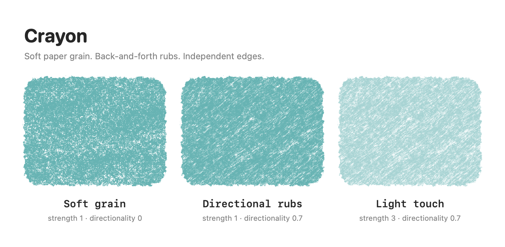
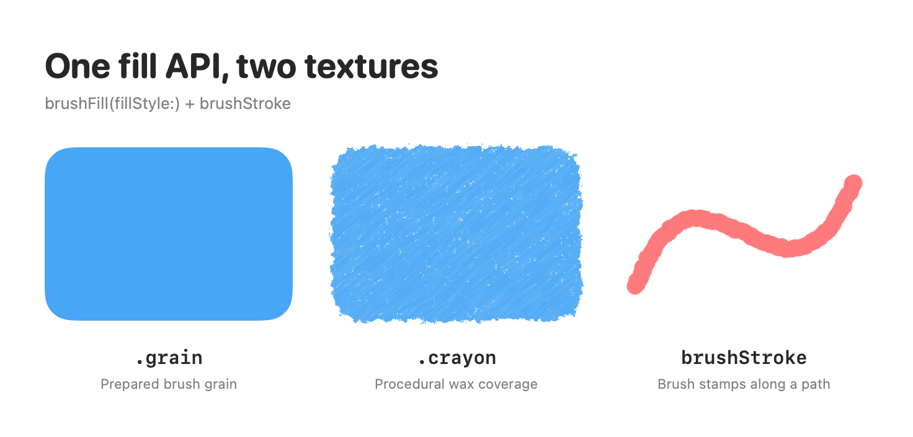
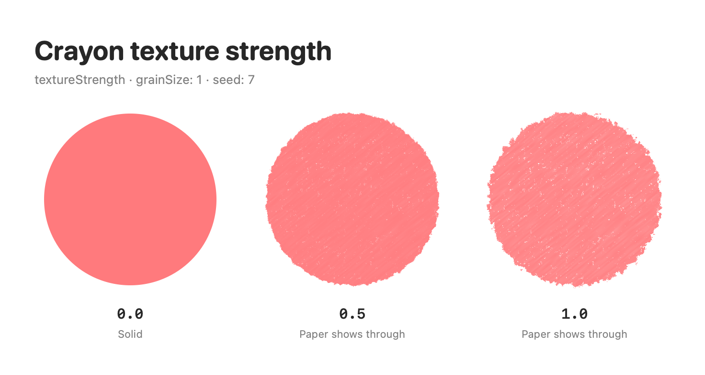

# Crayon

[EN](README.md) · [KR](README.ko.md) · [JP](README.ja.md) · [CN](README.zh-CN.md)

用于在 SwiftUI 中绘制蜡笔填充、笔刷描边、粗糙边缘和手绘抖动动画的 Swift Package。
无需外部图片即可生成蜡笔质感，也可以使用自定义笔刷笔尖和颗粒纹理。



- **支持环境：** iOS 17+ · macOS 14+ · Swift tools 5.9+
- **产品 / import：** `Crayon`
- 基于 SwiftUI，无外部包依赖。

## 快速开始

在 Xcode 中选择 **Add Package Dependencies**，输入
`https://github.com/eraser3031/crayon.git`，选择版本 **0.1.0**，
然后将 `Crayon` 产品添加到应用 target。

```swift
import SwiftUI
import Crayon

struct Drawing: View {
    var body: some View {
        RoundedRectangle(cornerRadius: 24)
            .brushFill(
                color: Color(red: 1, green: 0.84, blue: 0.25),
                textureStrength: 0.9,
                fillStyle: .crayon(grainSize: 1, seed: 7)
            )
            .frame(width: 280, height: 180)
            .padding(16)
    }
}
```

也可以在其他 Swift Package 中将其添加为依赖。

```swift
// Package.swift 中的 dependencies
.package(url: "https://github.com/eraser3031/crayon.git", from: "0.1.0")

// 使用方 target 的 dependencies
.product(name: "Crayon", package: "crayon")
```

本地开发时可使用 Xcode 的 **Add Local** 或 `.package(path: "../crayon")`。

## 可以绘制什么？

| API | 用途 |
| --- | --- |
| `Shape.brushFill(..., fillStyle: .grain)` | 使用预备的笔刷颗粒纹理填充，这是默认样式 |
| `Shape.brushFill(..., fillStyle: .crayon(...))` | 带有蜡层叠加、纸面空隙和粗糙边缘的蜡笔填充 |
| `Shape.brushStroke` / `Path.brushStroke` | 沿路径连续印下笔尖，形成笔刷描边 |
| `Color.texturing` | 为纯色形状添加粗糙边缘 |
| `View.boiling` | 添加轻微的手绘抖动动画 |



这些预览由本仓库的公开 API 渲染，使用默认的 `.monoline` 笔刷。
传入自定义笔刷后，`.grain` 填充和笔刷描边的外观会随之变化。

## 蜡笔填充

在**同一个 `brushFill` API** 中通过 `fillStyle` 选择蜡笔样式。
无需额外的蜡笔修饰符或纹理图片。

渲染器简化模拟了三次涂抹的蜡层在固定纸面凹凸上堆积的过程。
压力未能触及的凹槽会露出纸面，反复涂抹的区域则留下柔和的斜向浓淡变化。
边缘也会体现收笔位置和细小颗粒的变化，不会额外绘制轮廓线。



| 设置 | 默认值 | 说明 |
| --- | --- | --- |
| `color` | `.primary` | 填充颜色，保留颜色本身的不透明度。 |
| `textureStrength` | `0.8` | `0...1`。0 为纯色，1 时纸面空隙和粗糙边缘最明显。 |
| `.crayon(grainSize:)` | `1` | `0.5...4`。控制纸面颗粒和涂抹痕迹的空间大小。 |
| `.crayon(seed:)` | `0` | 在相同尺寸和设置下复现同一纹理图案。 |

`grainScale` 和 `BrushTip` 用于 `.grain` 样式。
`fillStyle` 选择纹理；单独的 `style: FillStyle` 参数控制 SwiftUI 的奇偶填充规则和抗锯齿设置。

布局尺寸保持不变，但蜡笔颗粒会略微超出原始边界。
渲染预留空间为 `ceil(5 × grainSize × textureStrength) + 1` pt。
父视图的 `.clipped()` 可能裁掉这些颗粒。强度为 0 时不会额外向外延伸。

## 笔刷填充与描边

```swift
RoundedRectangle(cornerRadius: 24)
    .brushFill(.monoline, color: .orange, textureStrength: 0.8)
    .overlay {
        RoundedRectangle(cornerRadius: 24)
            .brushStroke(.monoline, color: .brown, width: 3)
    }
    .frame(width: 220, height: 140)
```

`brushStroke` 支持调整 `width`（pt）、`spacing`、`flow` 和 `grainScale`。
描边以形状边界为中心绘制，请留出足够空间以显示外侧部分。
`Path` 也支持同样的 API。

### 自定义笔刷

```swift
// 从图片文件 URL 加载一次，然后重复使用。
let tip = try BrushTip(shapeURL: shapeURL, grainURL: grainURL)

// 在 SwiftUI 视图中使用
Circle()
    .brushFill(tip, color: .blue, grainScale: 240)
    .frame(width: 160, height: 160)
```

`BrushTip.monoline` 是内置笔刷，无需外部资源。
图片加载器会将白底黑色笔迹转换为 alpha 遮罩，并裁去笔尖图片的透明边距。
输入图片每边最大为 4096 px；无法读取时会抛出 `BrushTip.LoadError.invalidImage`。
不直接解析 Procreate 笔刷文件。

## 边缘纹理

```swift
Color.blue.texturing(
    in: .roundedRectangle(cornerRadius: 12),
    x: 0.5, y: 0.5, radius: 4,
    pattern: TexturingPattern(
        grainSize: 0.6, coarseSize: 3, roughness: 0.4, seed: 42
    )
)
.frame(width: 220, height: 140)
```

此效果用于纯色形状。`TexturingShape` 支持矩形、圆角矩形、胶囊和圆形，
也可以作为普通 `Shape` 使用。圆角采用 circular 样式。
相同的 seed 和坐标会生成相同的图案。

## 手绘抖动动画

```swift
Circle()
    .brushStroke(.monoline, color: .blue, width: 4)
    .boiling(amount: 1.2, framesPerSecond: 6)
    .frame(width: 120, height: 120)
```

在三种固定形变之间循环切换。请将其应用于装饰视图，以免背景和文字一起抖动。
启用“减弱动态效果”、场景不活跃或视图离开屏幕时，动画会停止。
README 图片为静态图片，请在示例应用中查看动画。

## 运行示例应用

在 Xcode 中打开 [CrayonSample.xcodeproj](Examples/CrayonSample/CrayonSample.xcodeproj)，
选择 `CrayonSample` scheme，并在 iOS Simulator 或 My Mac 上运行。
示例直接引用仓库内的本地包，无需单独安装。

可以调整颜色、纹理强度和蜡笔痕迹大小，对比蜡笔填充、默认颗粒纹理、笔刷描边和边缘纹理。
还提供了开启或关闭手绘抖动的开关。

如果另一个已打开的项目正在使用同一个本地包，Xcode 可能提示
`already opened from another project or workspace`。
请关闭对应项目窗口，再重新打开示例。

```sh
xcodebuild -project Examples/CrayonSample/CrayonSample.xcodeproj \
  -scheme CrayonSample -destination 'generic/platform=iOS Simulator' \
  build CODE_SIGNING_ALLOWED=NO
```

## 开发与验证

```text
Sources/Crayon/
  BrushStroke/        # 描边与填充公开 API、采样、蜡笔渲染器、栅格缓存
  Texturing/          # 边缘纹理 API 与渲染器
  Boiling/            # 手绘抖动 View modifier
  Shaders/            # EdgeTexture.metal, LineBoil.metal
Examples/CrayonSample/ # iOS / macOS 示例应用
Tests/CrayonTests/     # 几何、图片加载、公开 API 和渲染回归测试
Tools/PreviewGenerator/ # README 图片生成工具
Documentation/Images/ # 生成的预览 PNG
```

需要能够编译 Metal 的 Xcode / Metal Toolchain。
着色器会编译为包资源中的 `default.metallib`，并通过 `ShaderLibrary.bundle(.module)` 加载。
不依赖应用默认的着色器库或 `Bundle.main`。

```sh
swift build
swift test
```

如果 SwiftPM 无法找到 Metal Toolchain，可以使用以下命令运行 Swift 代码的回归测试。
native 构建系统仅复制 Metal 源文件，因此还需要执行上面的 Xcode 示例构建，以验证着色器编译。

```sh
swift test --build-system native
```

最近的实现验证结果：**11 项回归测试通过**，**iOS Simulator 示例应用构建成功**。
请在示例应用中查看实际效果与动画。根目录的包是库，没有可供 `swift run` 运行的目标。

### 重新生成预览图片

在 macOS 上从仓库根目录运行。工具通过 SwiftUI `ImageRenderer` 渲染实际的 `Crayon` 公开 API，
生成 2 倍分辨率的 PNG，使用固定 seed 和浅色模式。

```sh
swift run --package-path Tools/PreviewGenerator --build-system native \
  PreviewGenerator Documentation/Images
```

此工具生成蜡笔填充、颗粒填充和笔刷描边的静态预览。
基于 Metal 的边缘效果和手绘抖动请在示例应用中查看。
